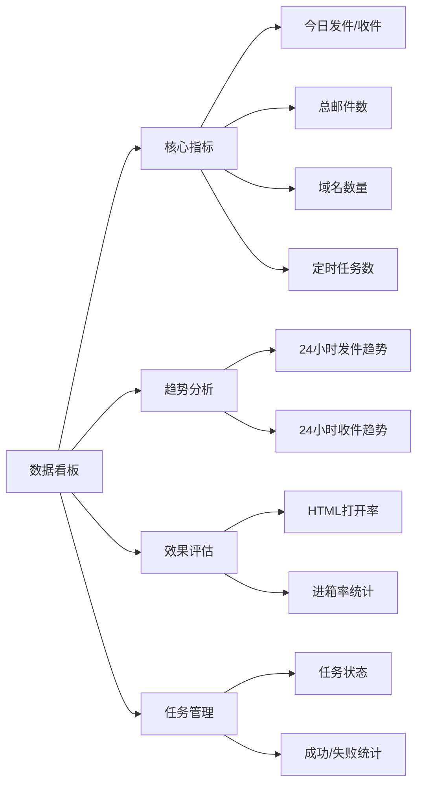
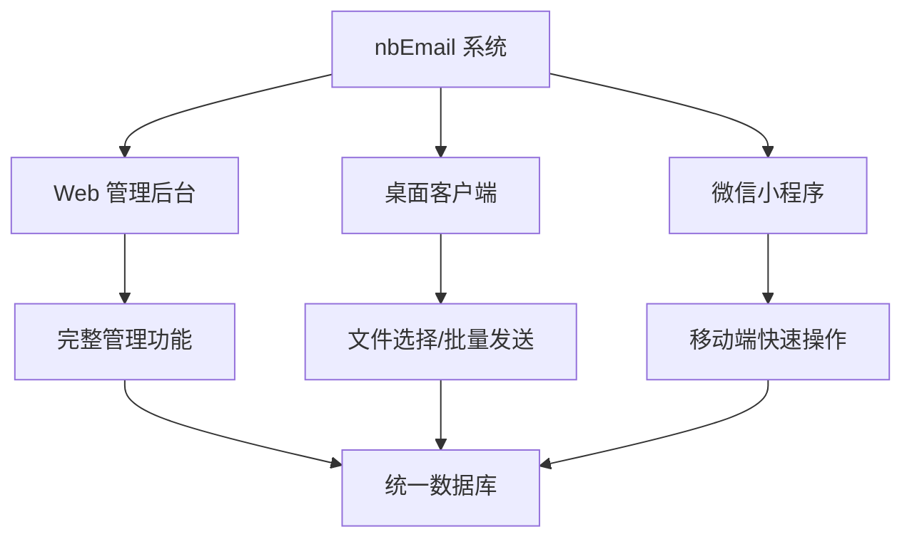

# nbEmail - 企业级邮件自动化营销平台

     

> **无限生成邮箱 · 日发上万 · 智能管理 · 多端协同**

nbEmail 是一款功能强大的企业级邮件自动化营销系统，专为需要大规模邮件投放、收件监控、精细化管理的团队和企业设计。系统支持 Web 管理后台、桌面客户端和微信小程序多端协同，让邮件营销变得简单高效。

nbEmail 是一个小巧而强大的邮件管理系统，拥有强大的电子邮件营销功能，旨在提供高效、简洁、现代化的邮件收发体验。支持群发、收信、提取验证码、SMTP调用、API控制等多种高级功能。

nbEmail 一键部署，无需依赖宝塔等第三方面板，轻量、独立、快速上手！

---

## 📖 项目简介  

**NBEmail** 是一个小巧而强大的邮件管理系统，拥有强大的电子邮件营销功能，旨在提供 **高效、简洁、现代化** 的邮件收发体验。  
支持群发、收信、提取验证码、SMTP调用、API控制等多种高级功能。  

> 💡 NBEmail 一键部署，无需依赖宝塔等第三方面板，轻量、独立、快速上手！

---

## 🌈 授权联系  

- 💬 版本授权联系作者：**wx：tmd6637**  
---
## ⚠️ 傻狗名单（提醒大家注意这些傻逼玩意，避免上当受骗）

- 同行再他妈偷窥你爹原创功能吧尼玛杀了，就知道偷别人的东西，自己没脑子吗。
- 司马彭春福（2014131458），再看把你吗杀了，自己弄了个偷东西的邮箱，写上我程序名字进行乱发污蔑、诈骗，这种人应该去死。
- 2165468532 喜欢倒卖我程序，疯狗特性，网络乞丐。换别人昵称换别人头像进行诈骗。
- 后续几个后面再添加，都是拿我软件污蔑、倒卖的狗比玩意。

---

## ✨ 核心特性  

> 💪 NBEmail 不仅仅是一个邮件工具，而是一套完整的 **邮件收发自动化解决方案**。

| 🌟 特性 | 💡 说明 |
|:--|:--|
| ⚡ **现代技术栈** | 基于 **Go + Vue + Vite + SQLite** 架构，极速高效 |
| 🧩 **多账号支持** | 多系统账户 & 邮件子账号分离 |
| 📨 **自动提取邮件信息** | 自动识别验证码、提取链接，提高工作效率 |
| 🧠 **发信智能优化** | 特殊算法让邮件更容易进入 Hotmail、Outlook、Gmail、163邮箱、QQ邮箱 等收件箱 |
| 🔒 **访问与安全控制** | 支持 API 访问、SMTP 调用、鉴权校验 |
| 💻 **多端适配** | 兼容 PC、移动端，UI 自适应 |
| 🚀 **一键部署** | 不依赖宝塔面板，直接运行即可使用 |
| 🧪 **高分发信测试** | 邮件发信测试评分满分 🔴 **10 分** |

---

### 强大的数据看板
- **实时统计**：今日发件/收件数量、总邮件数、域名数、任务数一目了然
- **24小时趋势**：每小时发件/收件数据可视化，掌握邮件投放节奏
- **打开率分析**：HTML 邮件打开率统计，评估营销效果
- **进箱率监控**：邮件送达进箱率分析，优化发送策略
- **任务概览**：定时任务状态、成功/失败统计，任务管理更轻松

---

---

## 系统功能预览

  
    
  
    
  
    
  
    
  
    
  
    
  
    
  
    
  

---

## 群发工具演示

  
  
  
  
  
  

---

## 典型应用场景

### 1. 大规模邮件营销
- 批量生成数千个邮箱账号作为发件池
- 定时发送营销邮件，日发量可达上万封
- 实时监控发送效果，优化营销策略

### 2. 企业邮件管理
- 集中管理企业所有邮箱账号
- 统一收件管理，不错过重要邮件
- 权限分级管理，保障数据安全

### 3. 渠道代理商运营
- 为客户提供邮箱账号购买服务
- 灵活的配额管理，按需分配资源
- 完整的订单和支付系统

### 4. 移动办公协同
- 微信小程序快速发件/收件
- 桌面端处理批量任务
- 多端数据同步，办公更高效

---

## 授权联系

- 版本授权联系作者：微信 tmd6637

---

## Star 历史趋势

---

**让邮件营销更简单，让管理更高效！**
